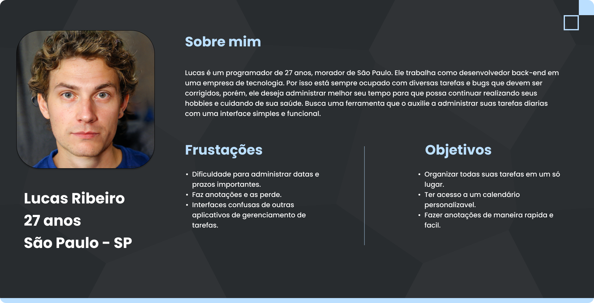
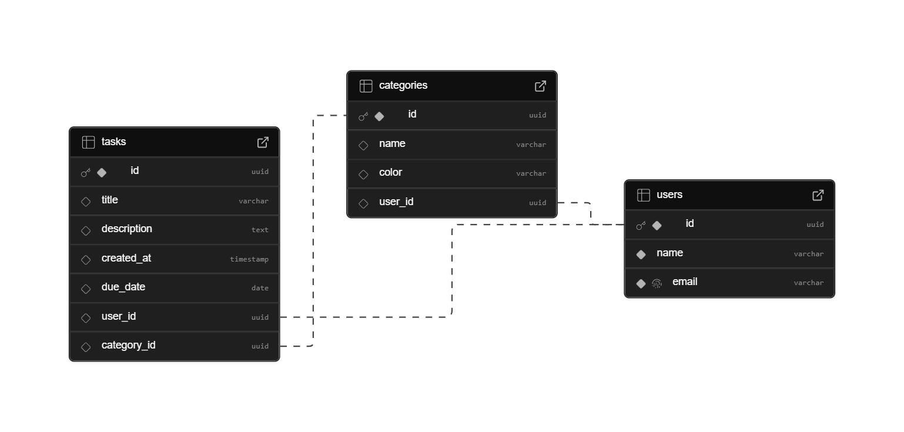

# Web Application Document - Projeto Individual - Módulo 2 - Inteli

**_Os trechos em itálico servem apenas como guia para o preenchimento da seção. Por esse motivo, não devem fazer parte da documentação final._**

## Taskly

#### Autor do projeto <a href="https://www.linkedin.com/in/yudi-omaki/"> Yudi Omaki

## Sumário

1. [Introdução](#c1)  
2. [Visão Geral da Aplicação Web](#c2)  
3. [Projeto Técnico da Aplicação Web](#c3)  
4. [Desenvolvimento da Aplicação Web](#c4)  
5. [Referências](#c5)  

<br>

## <a name="c1"></a>1. Introdução (Semana 01)

O Taskly é uma aplicação web com o objetivo de tornar a rotina das pessoas mais organizada e produtiva, auxiliando no gerenciamento de tempo durante a realização de atividades diárias.

O site oferece uma interface simples e intuitiva, na qual o usuário pode adicionar tarefas que devem ser realizadas durante a semana, fazer anotações e acessar um calendário personalizável.

O Taskly é a aplicação ideal para todos que desejam manter o controle de suas tarefas pessoais e profissionais de maneira eficiente, por meio de uma interface agradável e funcional.

---

## <a name="c2"></a>2. Visão Geral da Aplicação Web

### 2.1. Personas (Semana 01)

Personas são representações fictícias do usuário ideal para um determinado produto ou serviço. Elas são criadas com base em informações e dados reais sobre o público-alvo, com o objetivo de compreender melhor os usuários e suas necessidades. Isso permite que sejam feitas as adaptações necessárias ao longo do processo de desenvolvimento, garantindo que o produto final atenda de forma mais eficaz às expectativas do público.
<div align="center">
    <sub>FIGURA X - Persona-Lucas</sub>
        
    <sup>Fonte: Autoria própria (2025)</sup>
</div>

Lucas Ribeiro é um programador de 27 anos, mora em São Paulo e tem uma grande paixão por tecnologia. Com uma rotina intensa, ele busca uma maneira eficiente de administrar suas tarefas profissionais e pessoais em uma única aplicação web.

Ele precisa que a aplicação web ofereça uma visualização clara de anotações e lembretes, além da opção de personalização do calendário, para não perder datas importantes.

No entanto, Lucas enfrenta diversas frustrações com os serviços disponíveis atualmente, que apresentam interfaces confusas e com pouca possibilidade de personalização.

A solução oferecida pelo Taskly entrega a aplicação web ideal para o usuário, com personalização fácil e uma interface simples e intuitiva.

### 2.2. User Stories (Semana 01)
Identificação | US01 
--- | ---
Persona | Davi
User Story | "Como usuário, quero adicionar tarefas a prazos especificos, para me organizar"
Critério de aceite 1 | CR1: O usuário deve ter a possibilidade de criar novas tarefas.
Critério de aceite 2 | CR2: A tarefa deve conter nome obrigatoriamente.
Critério de aceite 3 | CR3: Ao atualizar a página, a tarefa deve continuar visivél.
Critérios INVEST |**Independente**: Pode ser desenvolvida de maneira isolada <br>**Negociável**: A interface é ajustada conforme as preferências do usuário.<br>**Valiosa**: As funcionalidades do Taskly permitem que o usuário acompanhe suas tarefas diarias de forma mais rápida e eficiente.<br>**Estimável**: As tarefas e funcionalidades podem ser estimadas com clareza, envolvendo etapas tecnicas bem definidas.<br>**Small (Pequena)**: As histórias de usuário e funcionalidades são divididas em partes pequenas e gerenciáveis.<br>**Testável**: Cada funcionalidade pode ser testada para garantir que está funcionando corretamente.

Identificação | US02 
--- | ---
Persona | Pedro
User Story | "Como usuário, quero vizualizar minhas tarefas no calendário, para ter melhor vizualização das tarefas"
Critério de aceite 1 | CR1: A aplicação deve exibir um calendário na interface principal.
Critério de aceite 2 | CR2: As tarefas ou lembretes devem aparecer em suas respectivas datas no calendário.
Critério de aceite 3 | CR3: O usuário deve ter acesso a tarefas ao clicar em um dia.

Identificação | US03
--- | ---
Persona | Eduardo
User Story | "Como usuário, quero ser notificado proximo a datas limites de tarefas, para não perder compromissos importantes"
Critério de aceite 1 | CR1: O usuário deve definir qaul horario deseja ser notificado ao criar ou editar a tarefa.
Critério de aceite 2 | CR2: A notificação deve ser enviada no horário configurado.
Critério de aceite 3 | CR3: O usuário pode optar por ativar ou desativar as notificações.

---

## <a name="c3"></a>3. Projeto da Aplicação Web

### 3.1. Modelagem do banco de dados  (Semana 3)

Nesta primeira etapa do projeto, foram utilizadas 3 tabelas: users, categories e tasks. Organizadas de maneira relacional, permitindo o acesso a informações de diferentes tabelas por meio de “Primary Keys” e “Foreign Keys”.

### Modelo Relacional
<div align="center">
    <sub>FIGURA X - Modelo Relacional</sub>
        
    <sup>Fonte: Autoria própria (2025)</sup>
</div>

### Modelo Físico

```
drop table if exists tasks; 
drop table if exists categories;
drop table if exists users;
create table users (
  id uuid primary key default gen_random_uuid(), /*O uuid gera automaticamente um id, utilizando o gen_random_uuid*/
  name varchar(100) not null,
  email varchar(100) unique not null
);

create table categories (
  id uuid primary key default gen_random_uuid(),
  name varchar(100),
  color varchar(100),
  user_id uuid references users(id) 
);

create table tasks (
  id uuid primary key default gen_random_uuid(),
  title varchar(100),
  description text, /*"text" faz com que não tenha limite de letras*/
  created_at timestamp default now(),
  due_date date,
  user_id uuid references users(id),
  category_id uuid references categories(id)
);
```
O modelo físico pode ser consultado [**aqui**](..\scripts\init.sql)

### 3.1.1 BD e Models (Semana 5)
*Descreva aqui os Models implementados no sistema web*

### 3.2. Arquitetura (Semana 5)

*Posicione aqui o diagrama de arquitetura da sua solução de aplicação web. Atualize sempre que necessário.*

**Instruções para criação do diagrama de arquitetura**  
- **Model**: A camada que lida com a lógica de negócios e interage com o banco de dados.
- **View**: A camada responsável pela interface de usuário.
- **Controller**: A camada que recebe as requisições, processa as ações e atualiza o modelo e a visualização.
  
*Adicione as setas e explicações sobre como os dados fluem entre o Model, Controller e View.*

### 3.3. Wireframes (Semana 03)

*Posicione aqui as imagens do wireframe construído para sua solução e, opcionalmente, o link para acesso (mantenha o link sempre público para visualização).*

### 3.4. Guia de estilos (Semana 05)

*Descreva aqui orientações gerais para o leitor sobre como utilizar os componentes do guia de estilos de sua solução.*


### 3.5. Protótipo de alta fidelidade (Semana 05)

*Posicione aqui algumas imagens demonstrativas de seu protótipo de alta fidelidade e o link para acesso ao protótipo completo (mantenha o link sempre público para visualização).*

### 3.6. WebAPI e endpoints (Semana 05)

*Utilize um link para outra página de documentação contendo a descrição completa de cada endpoint. Ou descreva aqui cada endpoint criado para seu sistema.*  

### 3.7 Interface e Navegação (Semana 07)

*Descreva e ilustre aqui o desenvolvimento do frontend do sistema web, explicando brevemente o que foi entregue em termos de código e sistema. Utilize prints de tela para ilustrar.*

---

## <a name="c4"></a>4. Desenvolvimento da Aplicação Web (Semana 8)

### 4.1 Demonstração do Sistema Web (Semana 8)

*VIDEO: Insira o link do vídeo demonstrativo nesta seção*
*Descreva e ilustre aqui o desenvolvimento do sistema web completo, explicando brevemente o que foi entregue em termos de código e sistema. Utilize prints de tela para ilustrar.*

### 4.2 Conclusões e Trabalhos Futuros (Semana 8)

*Indique pontos fortes e pontos a melhorar de maneira geral.*
*Relacione também quaisquer outras ideias que você tenha para melhorias futuras.*


## <a name="c5"></a>5. Referências

_Incluir as principais referências de seu projeto, para que seu parceiro possa consultar caso ele se interessar em aprofundar. Um exemplo de referência de livro e de site:_<br>

---
---
